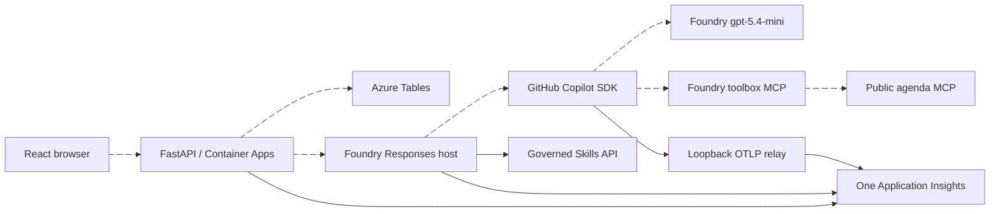

# Implementation - Geneva Event Companion

Status: **Implemented and validated; Azure deployment pending.**
Updated: 2026-09-20.

## Components actually built

| Component | Implementation |
| --- | --- |
| Frontend | React/TypeScript/Vite; responsive agenda, room filters, immediate questions/voting, private suggestion receipts, and cited event-guide responses. No external font/CDN dependency. |
| Backend | FastAPI on port 8000; typed bounded inputs, consistent errors, CORS, 64 KiB body limit, per-instance mutation throttling, and an explicit 60-second agent deadline including credential acquisition. |
| Persistence | Azure Table Storage in Azure; explicitly selected durable SQLite for local development. No in-memory or silent production fallback. |
| MCP | MCP SDK 2.2 `MCPServer`, mounted at `/mcp`, exposing only `get_event_agenda`. No private suggestion read tool. |
| Agent | Real GitHub Copilot SDK BYOK, Responses protocol 2.0, governed skill download, promoted toolbox discovery, read-only tool whitelist, and evidence-checked citations/refusal. |
| Telemetry | Shared keyless Azure Monitor exporters; redacting spans/logs, typed SDK token metrics, and an in-process loopback-only OTLP relay for CLI child spans. |
| Infrastructure | Extended maintained Foundry scaffold with SWA Free, ACA backend, Basic ACR, Tables, one shared Insights/workspace pair, UAMIs, scoped access, and runtime-agent RBAC reconciliation. |
| Demo automation | Versioned `.github/skills/meeting-to-issues/SKILL.md`, with human approval before issue creation and no automatic coding-agent assignment. |
| CI | Pinned GitHub Actions for Python, frontend, and browser checks. Not active without a configured/pushed Git remote. |

The diagram describes the implemented wiring, not a claim that Azure endpoints
are already deployed. The local backend uses SQLite, not Azure Tables.

## Correctness and privacy

Question creation and its lookup index share an atomic Table transaction.
Idempotency keys return the original record for an identical retry and reject
changed text. Votes insert the voter/question pair and update the ETag-protected
count in one same-partition transaction. Conflicts have bounded retries; other
storage failures surface. SQLite uses explicit transactions and closes each
connection.

Only public questions and agenda facts can be read by browsers. Feature
suggestions return a receipt after persistence and have no public read route.
The baseline intentionally has no French toggle, moderation/approval fields,
or Excel export.

The agent reads skills from Foundry into a bounded `/tmp` directory; ZIP paths
are never extracted. Its code package contains no authoring skills directory.
Only the discovered agenda tool is available; permission requests for other
operations are rejected. Citations must refer to evidence returned in the
current call, and tool failures cannot be converted into successful answers.
The backend independently validates public citation IDs.

Attendee input is never captured in telemetry. Only explicitly enabled public
agenda content may be captured. The Responses host's default observability
setup is disabled in favor of the already-initialized keyless/redacting
pipeline, avoiding duplicate exporters and its default sensitive-data capture.

## Resolved dependency and API contract

- Python 3.14.4; `uv.lock` and exported hashed requirements are committed.
- Copilot SDK **1.0.13**, Python minimum **3.11**. Public PyPI has 1.0.14, but
  the configured package feed does not; it was not bypassed.
- `await client.create_session(**keyword_configuration)`.
- `await session.send_and_wait(prompt_string, timeout=45)`.
- Return is `SessionEvent | None`; assistant text is `response.data.content`.
  Token events are `SessionEventType.ASSISTANT_USAGE` with typed input/output counts.
- Client and session both use asynchronous context managers.
- Actual bundled-runtime session creation and teardown passed without invoking
  a model. OpenAI 3.16.1 and Projects SDK 2.7.0 are compatible in the resolved graph.
- Projects SDK provides the actual `/openai/v1/` inference base URL. The MCP 2
  transport uses `httpx2`, and tool schemas use `input_schema`.
- React 19.3.0, Vite 8.3.0, TypeScript 7.0.2, and Node 24; exact frontend
  dependency graph is in `src/frontend/package-lock.json`.

## Infrastructure and lifecycle

Service names are reconciled to `frontend`, `backend`, `ai-project`, and
`event-guide`. The backend builds in ACR with a small service-local Docker context. The export
hook stages a generated copy of the single telemetry source, avoiding a mutable
repository-wide archive. Generated requirements and telemetry are written
atomically and unchanged files are not rewritten during parallel packaging.
The ejected Foundry layer provisions the shared app foundation; application and
runtime-access layers retain azd ownership.

Preprovision checks both `az` and `azd` caller identity, stable role IDs,
inherited/group assignments, and live role definitions. A discovered identity
mismatch was resolved only after explicit user approval to set the user-wide
`azd` setting `auth.useAzCliAuth=true`. The complete gate now passes.

Skill publication and connection registration precede toolbox publication.
Backend readiness precedes agent deployment checks. Runtime identity grants are
reconciled through a dedicated Bicep layer after those identities exist. The
frontend predeploy hook rebuilds and checks its bundle against the actual API
origin, including when `azd up` packaged before provisioning.

## Plan deviations

1. Copilot SDK 1.0.13 replaces unavailable-in-feed 1.0.14; inspected and tested.
2. OpenAI >=3,<4 replaces the sample's incompatible <3 upper bound.
3. MCP 2 calls the server class `MCPServer`, not the old `FastMCP`.
4. Installed agent extension beta.12 accepts a **300-second** minimum idle
   timeout, not the planned 120 seconds. The manifest uses 300; consumption costs
   remain usage-dependent. No extension was silently upgraded.
5. Local persistence is SQLite, enabling a durable local demo without Azure.
6. A single shared Python lock is exported for both Python deployment units,
   favoring one verified graph over diverging per-component dependency sets.

## Verification evidence

24 Python tests pass, including actual Responses-host serialization, public
MCP discovery, durable restart semantics, idempotency, concurrent voting, Table
transaction/ETag contracts, private suggestion boundaries, refusal, SDK API
shape, and telemetry redaction. Lint passes.

Frontend build and three component tests pass. Two real Chromium tests pass:
the complete attendee flow at 360px width with no horizontal overflow, plus the
desktop agenda and warm local API p95 under one second for ten concurrent
readers. Desktop/mobile screenshots were inspected.

Three Bicep entrypoints compile; the installed CLI schemas, compiled resource
contract, and 22 deployment-hook tests pass. The complete caller preflight
passes after the approved authentication alignment.

Actual Azure allocation, real Foundry model/skill/toolbox execution, runtime RBAC
propagation, distributed traces, and Azure restart persistence remain deployment
checks. No PR-preview success is claimed without a real remote and pull request.
