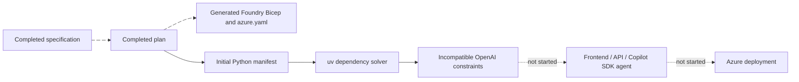

# Implementation - Geneva Event Companion

Status: **BLOCKED at dependency resolution; application not implemented.**
Updated: 2026-09-20.

## Completed work

- Completed `docs/spec.md` and `docs/plan.md`, including the mandatory
  post-Specify Agentic Loop policy and frozen cross-component contracts.
- Generated the maintained Foundry Responses/toolbox scaffold in an isolated OS
  temporary directory, with Bicep ejection.
- Merged generated `azure.yaml` and `infra/` into the existing repository without
  overwriting its documentation, instructions, or Git metadata.
- Initialized ignored local azd environment state and persisted the checked
  subscription, tenant, `eastus2`, resource group, project/model names, and flags.
  `AZD_AGENT_SKIP_ACR=false` is set because the eventual backend needs ACR.
- Added the initial Python dependency manifest and ran `uv sync --python 3.14`.
  uv obtained Python 3.14.4 and created `.venv`, but dependency resolution failed
  before installing the application dependencies or producing a lockfile.

## Blocking dependency conflict

The generated app manifest combines `azure-ai-projects==2.7.0` with `openai<3`.
The former requires `openai>=3.0.0`; these constraints cannot both be satisfied.
The newer Projects SDK version was selected from current PyPI metadata, while
the incompatible OpenAI upper bound was retained from the maintained sample.
This is an integration mistake in this run's initial manifest, not an Azure
permission or model-capacity failure.

The resolver exited 1. Official PyPI metadata independently confirms that
Projects SDK 2.7.0 requires OpenAI 3+. The Responses server 2.1.0 requires
`azure-ai-agentserver-core>=2.1.0,<2.2.0` and does not declare the conflicting
OpenAI upper bound. The run is paused under the explicit Implement/Spec2Cloud
failure rule; no dependency substitution or deploy bypass was attempted.

On resume, align the package constraints deliberately, then inspect the actual
installed APIs and complete the compatibility gate before writing service code.
The plan prefers current stable compatible packages; do not silently downgrade
Projects SDK or claim OpenAI 3 compatibility without checking the code.

## Architecture actually present

Only a generated infrastructure scaffold and an unresolved Python manifest
exist. There is no runnable application or deployed runtime architecture yet.

## Known scaffold differences still to reconcile

- The initializer's `--agent-name event-guide` changed the agent identity but
  retained service key/path `toolbox-python-responses`. Rename both to the frozen
  `event-guide` service and `src/agents/event-guide` path together.
- The scaffold uses `infra.provider: microsoft.foundry`; ejected Bicep is present.
  Preserve or intentionally adapt its synthesis semantics when adding the app.
- Generated `includeAcr` is false and the optional ACR module uses Premium.
  The planned backend requires one Basic ACR; neither change is implemented yet.
- The template does not supply the required frontend, backend, Tables, shared
  monitoring, runtime skills, or publication/preflight hooks. These are planned
  additions, not completed resources.
- The scaffold sample code was not copied into `src/`; it contains a handwritten
  model loop, not the required Copilot SDK application. The source scaffold is
  retained at `/tmp/geneva-companion-scaffold.NJheEJ/event-guide` for resume.

## Post-implementation checklist

| Check | Result |
| --- | --- |
| Local azd environment and `AZD_AGENT_SKIP_ACR=false` | Present |
| Dependency lock and installed SDK API verification | Blocked |
| Frontend/backend/MCP services and CORS | Not implemented |
| Copilot SDK hosted agent and dedicated endpoint | Not implemented/deployed |
| Governed Foundry skill/toolbox lifecycle | Not implemented |
| ACR remote build, application identities, and full RBAC hooks | Not implemented |
| Shared telemetry and child-process OTLP export | Not implemented |
| Local behavior/build tests | Not run; no application exists |
| Azure validation | Not invoked |
| `azd up` / endpoint / restart persistence / real agent checks | Not attempted |
| PR preview | Separately blocked by the absence of a Git remote |

Do not run `azd up` against this unfinished scaffold.
