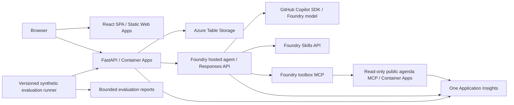

# Cloud and AI Day Geneva Event Companion - Specification

> Last updated: 2026-09-21
> Status: Specify complete with explicit autonomous defaults; placement and
> deployment remain gated by Plan, Implement, and Verify.

## 1. Summary

Build the small, deployed starting application for the Cloud and AI Day Geneva
demonstration on Monday, 21 September 2026. Attendees browse sessions, post
immediately visible questions, vote, and privately submit feature suggestions.
An event assistant implemented with the GitHub Copilot SDK demonstrates a real
governed agent loop over public event data. The application is the codebase that
the live meeting-to-pull-request demonstration will subsequently modify, not a
prebuilt implementation of those requested changes.

Requirements come from the user's explicit brief and an authenticated reading
of "Cloud and AI Day Geneva - Demo Plan - Meeting to Pull Request". The source
document and transcripts must not be copied into this repository.

## 2. Goals & Non-Goals

**Goals**

- Deliver an accessible, mobile-friendly English/French event companion and its
  Azure frontend endpoint before the demonstration.
- Persist questions, votes, and feature suggestions independently of API
  restarts; keep raw feature suggestions out of public responses and telemetry.
- Exercise a real Copilot SDK hosted agent, governed Foundry skill, and toolbox
  MCP tool with keyless Azure authentication and correlated telemetry.
- Evaluate the hosted event guide against a versioned, synthetic regression
  suite before deployment, so grounded-answer and refusal behavior can be
  measured without collecting attendee content.
- Make the code easy for subsequent coding-agent pull requests to change.
- Support Static Web Apps pull-request previews and document the remaining
  repository-hosting prerequisites if they cannot be established automatically.

**Non-goals**

- Do not implement a moderation/approval queue or approval audit trail, or
  Excel export/per-session reporting. These are intentionally reserved for the
  live demonstration.
- No autonomous GitHub issue creation, coding-agent assignment, merging, or
  execution of instructions from attendees or meeting transcripts.
- No attendee accounts, payment, registration, private enterprise search,
  custom guardrail service, evaluation of live attendee conversations, or
  production availability SLA.
- Do not generate a realistic secret or commit a credential for the demo.

## 3. Users & Scenarios

| Persona | Scenario | Success criteria |
| --- | --- | --- |
| Attendee | Find a session on a phone | Sessions show room, local start/end time, and description. |
| Attendee | Ask and vote on a session question | A valid question appears immediately after persistence; voting updates its total. |
| Attendee | Suggest an improvement | A success receipt is shown only after durable storage; other submissions are not exposed. |
| Attendee | Ask about the event | A real hosted agent uses the agenda tool and returns supported event references or an explicit no-evidence answer. |
| Presenter | Show the starting state | English/French UI, immediate questions, no moderation or export feature. |
| Developer | Add a requested feature later | Clear service boundaries, tests, stable IDs, and documented deployment commands. |

## 4. Functional Requirements

| ID | Requirement | Priority |
| --- | --- | --- |
| FR-001 | Render event name, date, venue, and sessions from a versioned JSON fixture; display event-local time in Europe/Zurich. | Must |
| FR-002 | Group/filter sessions by room and show chronological start/end times. | Must |
| FR-003 | Accept a session question containing 1-500 trimmed characters. Show it immediately after a successful durable write, without any moderation state. | Must |
| FR-004 | Poll questions at most every five seconds while visible and show explicit loading, empty, and error states. | Must |
| FR-005 | Allow one upvote per browser-generated voter ID per question, with an atomic, retry-safe stored vote and authoritative count. This is demo deduplication, not verified attendee identity. | Must |
| FR-006 | Accept a feature suggestion containing a 1-100-character title and 1-2000-character description; return a receipt ID only after persistence. | Must |
| FR-007 | Never expose a public suggestion-list endpoint, raw suggestion feed, or projectable raw submission UI. | Must |
| FR-008 | Provide a compact event-assistant interaction backed by an actual Copilot SDK Foundry hosted agent, not a canned answer or local model substitute. | Must |
| FR-009 | Give the agent only read-only public agenda/venue tools, registered through a Foundry connection and toolbox. Answers about sessions must cite a returned session/source ID. Unsupported event facts produce an explicit refusal. | Must |
| FR-010 | Reject agent citations not present in actual tool results. Do not accept model assertions that a tool call or citation exists. | Must |
| FR-011 | Keep browser input, questions, and tool output as untrusted data. The agent cannot access shell, repository, filesystem outside its runtime scratch area, or GitHub mutation tools. | Must |
| FR-012 | Author reusable event-assistance behavior in `skills/event-guide/SKILL.md`; publish it to Foundry and download the governed version at runtime rather than bundling local skill files. | Must |
| FR-013 | Provide a versioned repository meeting-to-issues skill preserving speakers, generating exactly three small stories and 2-3 Given/When/Then criteria each, parking other material, and stopping for human approval before deterministic issue creation. Do not execute it during baseline setup. | Must |
| FR-014 | Document the operator-only audience-triage extension point, with read-only intake and approval before issue creation; do not make raw suggestions accessible to the public agent. | Should |
| FR-015 | Deploy the frontend to Azure Static Web Apps and support same-repository PR previews through GitHub Actions. Do not claim preview readiness until a real PR preview is verified. | Must |
| FR-016 | Return visible actionable service errors; disable submission while pending, preserve failed drafts, and prevent duplicate writes from retried requests. | Must |
| FR-017 | Clearly label any unverified schedule fixtures as demonstration/sample data; never invent confirmed event sessions or speakers. | Must |
| FR-018 | Provide a versioned synthetic evaluation dataset for the event guide. Each case MUST contain a stable ID, an event question, an expected outcome (`grounded` or `refused`), and—when grounded—the required public source IDs. It MUST NOT contain attendee submissions, transcripts, credentials, or personal data. | Must |
| FR-019 | Configure Foundry Evals for the hosted event guide and provide a repeatable command that invokes the same deployed/local agent request boundary used by the app. The command MUST submit the versioned synthetic cases to Foundry and emit a machine-readable, non-zero-on-failure summary. | Must |
| FR-020 | Evaluate at least grounding correctness, citation precision/recall against required source IDs, refusal correctness, and response-schema validity. A grounded result with absent, extra, or invalid citations MUST fail the applicable case. | Must |
| FR-021 | Make evaluation thresholds explicit and version-controlled: all cases must return the required response schema; grounding/citation and refusal correctness must each be 100%; the suite may not silently skip cases. | Must |
| FR-022 | Preserve a bounded evaluation report containing case IDs, pass/fail status, metric totals, agent/model/deployment identifiers, and timestamps. Reports MUST exclude raw private suggestions, attendee questions, bearer tokens, and full agent/tool prompts or responses by default. | Must |
| FR-023 | Run the synthetic Foundry evaluation suite as a documented pre-deployment verification gate. Evaluation failure blocks deployment approval but does not mutate event data or GitHub; it may create only the versioned Foundry evaluation artifacts and bounded reports required by this feature. | Must |
| FR-024 | Provide an explicit English/French switcher. Translate all attendee-facing interface text, preserve the current attendee context and entered data when switching, and retain the selected language while navigating. | Must |

## 5. Non-Functional Requirements

| Category | Requirement |
| --- | --- |
| UX | Responsive from 360px phone width to projector layout; keyboard operability, visible focus, semantic headings/labels, and sufficient contrast. |
| Performance | Warm non-AI API requests target p95 under 1 second at 10 concurrent clients; agent requests time out explicitly within 60 seconds. Measure rather than claim compliance from a mock. |
| Durability | Acknowledged writes survive application restart. Votes and idempotent submissions remain correct under concurrent retries. |
| Scale | One-event demo, approximately 150 simultaneous browsers; bounded lists, pagination, request-size limits, and per-instance abuse throttling. Not a production distributed anti-abuse system. |
| Identity | Managed identities and scoped RBAC for service-to-service Azure access. No storage keys, model keys, ACR admin credentials, or secrets committed to Git. |
| Privacy | Anonymous text only; display a notice not to submit personal/confidential information. Browser voter IDs are random and event-specific. Do not collect names, email, or attendee lists. |
| Retention | Document operator cleanup after seven days. No automatic destructive cleanup of existing resources. |
| Isolation | Questions are deliberately public; feature suggestions are private to authorized operators. Preview/test partitions must not mix with live event data. |
| Observability | One Log Analytics workspace and one Application Insights instance. Correlate backend, hosted-agent, toolbox/MCP, and model traces; emit request/tool/token metrics. |
| Content capture | Capture full synthetic public agenda/model/tool content in dev. Redact arbitrary attendee text and identifiers before telemetry export; never export raw private suggestions. Explicitly gate broader capture rather than silently logging PII. |
| Evaluation | Use only versioned synthetic cases. Evaluation output is bounded to identifiers, aggregate metrics, and diagnostic classifications; it does not capture raw inputs, outputs, tool payloads, or credentials. |
| Failure handling | Storage/model/toolbox failures produce non-success responses. No in-memory fallback that falsely acknowledges durable writes, no canned AI-success fallback. |

## 6. Architecture Overview

Use one Python backend service for REST and public read-only MCP if the selected
template/runtime supports this cleanly; otherwise a separate minimal MCP service
shares the same ACR and observability resources. The browser never receives
Foundry, storage, or deployment credentials. The public agent has no access to
the private-suggestions table. Private enterprise RAG is not part of this app,
so Foundry IQ/Search and embeddings are not provisioned.

The source runbook's explicit Static Web Apps hosting overrides the generic
Spec2Cloud Container Apps frontend default. The user's Copilot SDK requirement
and Agentic Loop policy override the generic MAF default; no MAF dependency or
backend orchestration is introduced.

## 7. Tech Stack

| Layer | Choice | Rationale |
| --- | --- | --- |
| Frontend | TypeScript, React, Vite | Matches the small SPA in the runbook. |
| Backend | Python, FastAPI, Azure Tables SDK | Small typed API, durable inexpensive event records. |
| MCP | Python MCP SDK 2.2 `MCPServer`, streamable HTTP | Current SDK name for the former FastMCP server; public event tool only. |
| Agent | Python, GitHub Copilot SDK, Foundry Responses server | Explicit user requirement; one agent framework. |
| Data | Azure Table Storage | Explicitly permitted by the runbook; minimal viable durable store. |
| Infrastructure | azd + Bicep, reuse maintained template/AVM modules | Repeatable deployment and scoped identities. |
| Delivery | GitHub Actions, Static Web Apps previews, azd | Reviewed incremental changes. |
| Testing | Python API/domain tests, agent-evaluation runner, frontend component tests, browser smoke | Cover baseline behavior, grounded-agent regression, and deployment. |

Resolve current compatible stable package releases during implementation and
commit lockfiles. Verify the installed Copilot SDK's Python minimum, session
creation, prompt sending, response/event shape, and lifecycle before coding
against it.

## 8. Azure Services

| Service | Purpose | Minimal candidate; Plan must validate |
| --- | --- | --- |
| Static Web Apps | SPA and PR preview hosting | Free if direct API access supports requirements; Standard only if backend-linking requirements demand it. |
| Container Apps | FastAPI and public MCP | Consumption; smallest measured viable CPU/memory, one warm replica for the demo. |
| Storage account | Question, vote, and suggestion tables | Standard LRS, shared-key access disabled. |
| Foundry account/project | Hosted agent, Skills API, connections/toolbox | Keyless, preview features disclosed and checked. |
| Model deployment | Text reasoning and tool use | `gpt-5.4-mini`, exact version/SKU/capacity validated live. |
| Container Registry | Container image source | Basic, admin user disabled, managed-identity pulls. |
| Application Insights / Log Analytics | Shared end-to-end telemetry | One of each, local authentication disabled where supported. |

Preferred placement: `francecentral`, explicitly requested for the `geneva`
environment. The September 21, 2026 subscription preflight found
`gpt-5.4-mini` version `2026-03-17` with `GlobalStandard` capacity available
there and confirmed the Foundry and Container Apps providers support the region.
Plan must still validate provisioning preview and hosted-agent data-plane
availability before deployment. Record any fallback and reconcile all documents
before implementation.

## 9. AI / Foundry - Mandatory Agentic Loop Contract

| Item | Requirement |
| --- | --- |
| Agent name / framework | `event-guide`, GitHub Copilot SDK only. |
| Protocol | Responses API; use invocations only for a demonstrated compatibility blocker recorded in Plan. |
| Model | Default `gpt-5.4-mini`; live resolution required, no unsupported model invented or silently substituted. |
| Reusable skill | Author locally, publish/update through `azd ai skill`, download the governed version into `/tmp` at runtime. |
| Toolbox | Author `src/tools.yaml`; publish after skills and connections with `azd ai toolbox create`; use its generated MCP endpoint. |
| Tools | Read-only public agenda lookup. Never hardcode a downstream tool endpoint in agent code. |
| Grounding | Validate source IDs against observed tool results; deterministic refusal when event claims lack evidence. No private knowledge base needed. |
| Safety | Foundry built-in guardrails plus ordinary input validation. No custom guardrail platform or evaluator deployment. |
| Evaluation | Foundry Evals with a versioned synthetic case file and an in-repository runner calling the public assistant boundary. Validate schema, grounding/citation precision and recall, and refusal correctness. The mandatory thresholds are 100% for each metric and no skipped cases. |
| Telemetry | Configure OTel before Copilot client/session startup, include child-process model spans and token usage, export to the shared Insights resource. |
| Writable state | Skills, session state, and scratch files under `/tmp`; assume a read-only hosted-agent filesystem. |

Required agent dependencies: `azure-identity`, `python-dotenv`,
`github-copilot-sdk`, `azure-ai-agentserver-responses`, `azure-ai-projects`,
`httpx`, `azure-monitor-opentelemetry-exporter`, `opentelemetry-sdk`, and
`opentelemetry-api`. Include `opentelemetry-instrumentation-openai-v2` if the
runtime makes in-process OpenAI calls. Do not introduce a Search SDK or MAF.

Infrastructure/hook role assignments must cover app ACR pulls; backend invocation
on the Foundry account; project image pulls; the actual acting agent identity's
BYOK inference; project/agent skill-tool access; backend Table access; and
Monitoring Metrics Publisher for telemetry-emitting identities. Use current
role IDs and the maintained Foundry RBAC guidance, not obsolete role names.
Grant inference rights to runtime identities after their creation, reproducibly.

Caller preflight passed after explicitly authorized Foundry role grants on
2026-09-20. This is a greenfield subscription-scoped deployment; exact target
identifiers remain in local environment/session artifacts, not public docs.
Wire the complete, corrected caller check as an azd `preprovision` hook.

## 10. Data Model

- **Event:** ID, public name, date, timezone, venue, fixture provenance.
- **Session:** immutable ID, title, room, start/end, description, sample marker.
- **Question:** event/session IDs, UUID, text, UTC creation timestamp,
  client-generated idempotency key; no moderation fields in the baseline.
- **Vote:** question ID and browser voter ID, unique/atomic pair; stored count
  must remain consistent under retries and concurrency.
- **Suggestion:** UUID, event ID, title, description, UTC timestamp, idempotency
  key; never included in public read APIs or public MCP results.
- **Evaluation case:** stable ID, synthetic question, expected outcome, required
  source IDs for grounded cases, and optional case grouping. Version it in Git;
  it contains no attendee or private content.
- **Evaluation report:** run ID, UTC timestamp, agent/model/deployment
  identifiers, case IDs, pass/fail status, diagnostic classifications, and
  aggregate metrics. Store only bounded metadata by default.

Partition by environment/event/session as appropriate. UTC storage and explicit
event timezone formatting; no reliance on server-local timezone.

## 11. Interfaces and Acceptance Gates

Public REST contract to freeze in Plan: health, event/sessions, question
list/create, idempotent vote, private suggestion create, and assistant request.
Use bounded JSON schemas and a consistent `{error: {code, message}}` failure
shape. POST receipts must be distinguishable from errors. No public admin API.

Agent answers return `{answer, citations, refused}`; citations contain validated
event/session IDs and public labels. No-evidence answers set `refused: true`.
Never trust an unvalidated model-generated citation or expose internal URLs.

The evaluation runner consumes the frozen assistant response shape and writes a
machine-readable report. A `grounded` case passes only if `refused` is false,
the response schema is valid, and its citation IDs exactly match the required
set. A `refused` case passes only if `refused` is true and citations are empty.
The runner exits non-zero if a case fails, cannot execute, or is skipped.

Before deployment: API/frontend tests pass; no deferred demo features exist;
atomic persistence/idempotency is verified; agent uses the resolved installed
SDK API; Bicep compiles; permissions, toolbox/skill discovery, and monitoring
configuration are checked. The synthetic agent-evaluation gate meets all
mandatory thresholds and produces its bounded report. After deployment: verify
the actual frontend, API, durable writes across a restart, one real grounded
hosted-agent request, and the deployed evaluation boundary.
Report PR-preview readiness separately from the main deployment.

Keep `.azure/deployment-plan.md` versioned and `.azure` environment state
ignored. Suggested environment name: `geneva-companion-dev-eus2`, to be adopted
autonomously only after placement succeeds. The reproducible azd source tree is
the deployable artifact; a separately downloadable prebuilt artifact is deferred
because none was provided or requested.

## 12. Open Questions Resolved by Autonomous Defaults

These markers preserve the requested decision trail. Each has an assumed answer,
not an unanswered implementation blocker. Revisit only if new evidence conflicts.

1. [NEEDS CLARIFICATION: Which target and identity? -- assumed: the active Azure subscription/user already checked, with role grants explicitly authorized by the user.]
2. [NEEDS CLARIFICATION: Existing resources? -- assumed: greenfield, with a dedicated app resource group.]
3. [Language and visual scope -- resolved: responsive, deliberately small English/French event UI with an explicit language switcher.]
4. [NEEDS CLARIFICATION: What schedule is authoritative? -- assumed: only runbook-confirmed facts are real; other seed sessions are explicitly marked samples until an official agenda is supplied.]
5. [NEEDS CLARIFICATION: How does the SDK appear in the baseline? -- assumed: a compact read-only event assistant; it neither implements deferred features nor creates issues.]
6. [NEEDS CLARIFICATION: Which store and frontend host? -- assumed: Azure Tables and Static Web Apps as explicitly allowed/required by the runbook.]
7. [NEEDS CLARIFICATION: Identity for attendees and voting? -- assumed: anonymous, with random browser voter IDs and demo-level deduplication, not fraud-proof identity.]
8. [NEEDS CLARIFICATION: Region/data residency? -- resolved: deploy the requested `geneva` environment to France Central; public/synthetic content only, with no private transcript ingestion.]
9. [NEEDS CLARIFICATION: Budget and scale? -- assumed: minimal consumption/free/basic tiers, one demo event, approximately 150 browsers, and a cost estimate in Plan before any provisioning.]
10. [NEEDS CLARIFICATION: Retention? -- assumed: seven-day cleanup documented for an operator; no automatic deletion.]
11. [NEEDS CLARIFICATION: Which GitHub organization/repository? -- assumed: use an existing configured remote if present; do not create or publish a public repository without an explicit target/authorization.]
12. [NEEDS CLARIFICATION: Which demo automation belongs in this build? -- assumed: versioned meeting-to-issues instructions and an operator triage extension point, but no live transcript processing, issue creation, or security-setting changes.]
13. [NEEDS CLARIFICATION: Telemetry content capture with anonymous submissions? -- assumed: full synthetic public agent/tool capture; redact attendee text and private suggestions before export.]
14. [NEEDS CLARIFICATION: Prebuilt deployment artifact? -- assumed: deliver reproducible source/azd artifacts, not a separately hosted binary bundle.]

Deployment decisions and verified placement belong in `.azure/deployment-plan.md`.

## 13. Post-Specify Agentic Loop Policy Application

Applied the already-invoked Agentic Loop policy immediately after generating
this specification and before invoking Plan. Sections 6-11 explicitly declare
the framework, governed skills/toolbox, Responses protocol, dependency intent,
identity/RBAC, monitoring, and durable deployment-artifact contracts. Plan must
freeze their concrete interfaces before implementation.

Companion discovery used GitHub CLI 2.101.0, `gh skill list`, the upstream preview
of every candidate below, and `gh skill update --dry-run`. Existing project
skills are unpinned and current according to the update check. User-scoped
Azure skills are installed but lack GitHub source/version metadata, so their
freshness cannot be proven; verify their examples against live CLI/API behavior.
Do not reinstall or patch them merely to fill that metadata gap.

| Skill | Trigger | Installed path / source | Status |
| --- | --- | --- | --- |
| agentic-loop | Mandatory user policy | `.agents/skills/agentic-loop`; `aiappsgbb/agentic-loop`, main | Current, unpinned |
| copilot-sdk | Explicit runtime framework | `.agents/skills/copilot-sdk`; `github/awesome-copilot`, main | Current, unpinned |
| microsoft-foundry | Hosted agents, skills, toolbox, RBAC | User skills directory; validated candidate `microsoft/azure-skills` | Installed, unpinned; freshness unknown |
| appinsights-instrumentation | End-to-end OTel | User skills directory; validated candidate `microsoft/azure-skills` | Installed, unpinned; freshness unknown |
| azure-storage | Durable tables | User skills directory; validated candidate `microsoft/azure-skills` | Installed, unpinned; freshness unknown |
| azure-prepare | azd/Bicep scaffolding | User skills directory; validated candidate `microsoft/azure-skills` | Installed, unpinned; freshness unknown |
| azure-validate | Predeployment gate | User skills directory; validated candidate `microsoft/azure-skills` | Installed, unpinned; freshness unknown |
| azure-deploy | azd execution | User skills directory; validated candidate `microsoft/azure-skills` | Installed, unpinned; freshness unknown |
| python-mcp-server-generator | Python streamable-HTTP MCP | `.agents/skills/python-mcp-server-generator`; `github/awesome-copilot@4f4796f0bf30e105700f97ed8408c12b6aa95e06` | Missing initially; installed automatically under unattended policy |

No MAF, AI Search, API Management, or Graph-authentication companion is required
by the selected baseline.

## 14. Approved policy-compliant networking amendment

Live deployment revealed an inherited management-group Modify policy that
disables public network access on Storage. The policy, not missing data roles,
blocks the public-network backend from reaching its table. The user explicitly
approved adding private connectivity and a VNet-integrated replacement backend.

Keep Storage public access disabled and shared keys disabled. Add a VNet with
separate Container Apps infrastructure and private-endpoint subnets, a Table
private endpoint, and its private DNS zone/link. Deploy a replacement Container
Apps environment/backend with public application ingress but private storage
egress. Reuse the existing storage account, data, backend UAMI, ACR, Foundry
project/model, and monitoring.

No policy exemption, public-access override, or key fallback is authorized.
Retain the old backend/environment until the replacement is verified; deleting
them requires separate approval. Reconcile the frontend API origin and governed
agenda connection/version as part of this explicitly approved migration.
